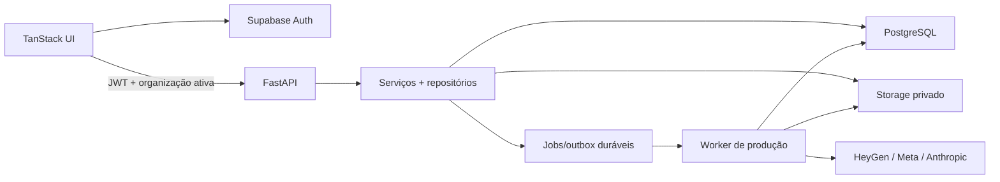

# Plano de migração: Google Sheets para PostgreSQL multi-tenant

Status: cutover do conteúdo principal concluído; operações e autenticação em execução
Data: 2026-08-13  
Branch: `codex/migrate-sheets-to-multitenant-db`

Progresso em 2026-08-17: a fundação SQLAlchemy/Alembic, o schema de 39 tabelas,
as chaves tenant-aware, o `TenantContext` e as policies RLS estão implementados
e testados contra PostgreSQL real. Radar, ideias, roteiros, calendário e
performance operam por repositórios PostgreSQL; `GET /api/state` e as mutações
da UI usam as rotas de domínio. O importador do snapshot é transacional e
idempotente, e o ambiente local está em `DATA_BACKEND=postgres`. Auth/JWKS,
storage e a migração do estado operacional ainda permanecem como próximas fases.

## Decisão recomendada

É viável abandonar as Sheets sem reescrever o produto. A recomendação é:

- usar PostgreSQL gerenciado como única fonte de verdade;
- adotar Supabase como composição inicial de PostgreSQL, Auth e Storage privado;
- manter o FastAPI como fronteira de negócio e não acoplar o frontend diretamente às tabelas na primeira etapa;
- acessar o banco por uma camada de repositórios com SQLAlchemy 2 e migrations Alembic;
- usar um banco compartilhado com `organization_id` obrigatório em todos os dados de cliente;
- aplicar Row Level Security (RLS) como segunda barreira de isolamento;
- mover vídeos, imagens e exports para object storage privado; no banco ficam metadados, checksums e chaves dos objetos;
- preservar os contratos atuais da API durante a transição e retirar as rotas `/api/sheets/*` somente depois do corte.

Supabase é a escolha pragmática porque entrega PostgreSQL real, autenticação integrada e storage privado com RLS e URLs assinadas. A camada de repositórios mantém a aplicação portável para outro PostgreSQL ou storage S3 compatível. Referências oficiais: [Database](https://supabase.com/docs/guides/database/overview), [Row Level Security](https://supabase.com/docs/guides/database/postgres/row-level-security), [Auth](https://supabase.com/docs/guides/auth/architecture) e [Storage privado](https://supabase.com/docs/guides/storage/buckets/fundamentals).

## Diagnóstico atual

Hoje há quatro fontes de estado sem uma fronteira de cliente:

| Fonte | Responsabilidade atual | Volume observado | Limitação |
| --- | --- | ---: | --- |
| Google Sheets + `sheets_snapshot.json` | Radar, ideias, roteiros, calendário e performance | 160 tendências, 14 ideias e 16 roteiros | Sem transações, relações fracas e dependência de rede/snapshot |
| `operations.db` (SQLite) | Jobs, editor, perfis de produção, Avatar Sets, planos, packs e uso de IA | 39 jobs, 16 estados de editor, 16 perfis e 2 Avatar Sets | Banco local e global, sem `organization_id` |
| JSON local | Configurações e cache de avatares | 1 configuração global | Não separa clientes nem permite auditoria |
| Sistema de arquivos | Uploads, vídeos, kits, exports e fotos | Mais de 4 GB | Caminhos locais, sem ownership e sem escala horizontal |

Pontos de integridade encontrados no snapshot atual:

- as 160 tendências ainda não têm ID persistido;
- 5 ideias não apontam para uma tendência;
- os 16 roteiros não apontam para uma ideia;
- calendário e performance estão vazios;
- credenciais HeyGen e Meta são globais por variável de ambiente;
- não existe autenticação, associação usuário-cliente ou autorização por papel;
- uma escrita de conteúdo atualiza primeiro a Sheet e depois o snapshot, permitindo divergência parcial.

O volume de registros é pequeno. A dificuldade principal não é capacidade do banco, e sim separar ownership, relações, arquivos e credenciais sem quebrar o fluxo de produção existente.

## Arquitetura alvo



O frontend continua consumindo o FastAPI. O JWT identifica o usuário; o backend resolve a organização ativa e cria um `TenantContext`. Nenhum repositório aceita consulta ou gravação de dados de negócio sem esse contexto.

### Fronteira de cliente

`organizations` representa cada cliente. O cliente atual será importado como uma organização inicial, por exemplo `Dr. Guilherme`.

Papéis iniciais:

- `owner`: gestão do cliente, membros, integrações e exclusões;
- `admin`: configuração e operação completa;
- `editor`: radar, ideias, roteiros e produção;
- `reviewer`: revisão e aprovação médica/editorial;
- `viewer`: somente leitura.

Cada tabela de negócio terá `organization_id UUID NOT NULL`. Restrições e chaves estrangeiras devem impedir que um registro de uma organização aponte para outro tenant. As políticas RLS validam a associação em `organization_memberships`.

### Modelo de dados proposto

| Grupo | Tabelas principais | Observação |
| --- | --- | --- |
| Tenant e acesso | `organizations`, `user_profiles`, `organization_memberships`, `audit_events` | Limite de isolamento e papéis |
| Configuração | `organization_settings`, `provider_connections` | Segredos ficam em secret manager/Vault, nunca em texto puro |
| Conteúdo | `trends`, `ideas`, `scripts`, `script_versions`, `script_reviews` | Relações opcionais para aceitar o legado incompleto |
| Identidade | `avatar_identities`, `avatar_looks`, `voices`, `avatar_sets`, `avatar_set_looks` | Separa a pessoa/personagem dos looks do provedor |
| Produção | `production_profiles`, `scene_plans`, `visual_plans`, `visual_packs`, `story_projects`, `story_versions` | Artefatos evolutivos podem usar `JSONB` versionado |
| Operações | `jobs`, `job_events`, `ai_usage`, `ai_response_cache` | Idempotência e custo sempre atribuídos ao tenant |
| Arquivos | `media_assets`, `asset_variants` | Storage key, MIME, tamanho, SHA-256 e origem |
| Publicação | `social_accounts`, `calendar_posts`, `performance_metrics` | Métrica ligada ao post, não por comparação de URL |
| Migração | `legacy_import_runs`, `legacy_id_map` | Importação retomável, auditável e idempotente |

Relação editorial principal:

```text
organization
  └─ trend ──> idea ──> script ──> script_version
                                      ├─ review
                                      ├─ production_profile ──> avatar_set/voice
                                      ├─ plans/packs
                                      └─ job ──> media_asset ──> calendar_post ──> performance_metrics
```

### Regras de schema

- IDs internos em UUID; IDs atuais (`t-*`, `i-*`, `s-*`, `p-*`) ficam em `legacy_id` e continuam resolvíveis por compatibilidade.
- `created_at`, `updated_at` e datas operacionais usam `timestamptz` em UTC; a organização guarda seu timezone.
- Campos pesquisáveis e relacionais ficam normalizados. Contratos grandes e evolutivos, como planos de cena, ficam em `JSONB` com `contract_version`.
- Status usam valores textuais validados pela aplicação e por `CHECK`, evitando enums PostgreSQL difíceis de evoluir.
- Exclusões editoriais relevantes usam `archived_at`; jobs e aprovações não são apagados fisicamente.
- Idempotência é única por organização: `UNIQUE (organization_id, kind, idempotency_key)`.
- Índices começam por `organization_id`, por exemplo `(organization_id, status, created_at DESC)`.
- Cache de IA com conteúdo de cliente é isolado por organização; somente cache comprovadamente público pode ser global.
- Objetos privados usam chave `organizations/{organization_id}/assets/{asset_id}/...` e URLs assinadas de curta duração.

## Estratégia de implementação

### Fase 0 — Salvaguardas e inventário

1. Fazer backup consistente da Sheet, do snapshot, do SQLite em WAL e do arquivo de configurações.
2. Gerar manifesto dos arquivos com caminho, tamanho e SHA-256.
3. Congelar o inventário de tabelas e campos usados pela API e pelo frontend.
4. Criar testes de caracterização para `GET /api/state` e para os fluxos CRUD atuais.

Saída: backup restaurável, relatório de contagem e contratos atuais protegidos por testes.

### Fase 1 — Fundação PostgreSQL e tenant

1. Adicionar SQLAlchemy 2, Alembic e driver PostgreSQL.
2. Criar migrations para tenant, conteúdo, identidade, operações, publicação e assets.
3. Integrar Supabase Auth; o FastAPI valida JWT pelo JWKS e resolve membership.
4. Criar `TenantContext`, autorização por papel e políticas RLS.
5. Criar a organização atual e o primeiro usuário `owner`.
6. Preparar PostgreSQL local para testes; produção usa apenas variáveis de ambiente/secret manager.

Saída: schema recriável do zero e testes negativos de isolamento entre dois tenants.

### Fase 2 — Camada de persistência sem mudar a UI

Status: núcleo editorial concluído. Migração de jobs, perfis, planos, packs e
uso de IA ainda pendente.

1. Extrair interfaces de repositório do `api/server.py`.
2. Implementar repositórios PostgreSQL para radar, ideias, roteiros, calendário e performance.
3. Manter `GET /api/state` com o mesmo formato, agora filtrado por organização.
4. Criar rotas de domínio (`/api/trends`, `/api/ideas`, `/api/scripts`, `/api/calendar-posts`) e manter aliases `/api/sheets/*` temporários.
5. Migrar configurações, editor, perfis, Avatar Sets, planos, packs, jobs e uso de IA para os mesmos repositórios.
6. Adicionar transações para alterações que hoje atravessam Sheet, snapshot e SQLite.

Saída: o app pode operar integralmente em PostgreSQL com a UI atual.

### Fase 3 — Importador legado idempotente

Status: concluído para snapshot de radar, ideias, roteiros, calendário e
performance. A importação do SQLite e dos assets segue na Fase 4.

Criar um comando com dois modos:

```bash
python -m tools.migrate_legacy_data --dry-run
python -m tools.migrate_legacy_data --apply --organization <uuid>
```

Ordem de importação:

1. organização, configurações e conexões sem segredos;
2. tendências, ideias, roteiros e revisões;
3. Avatar Sets, perfis de produção, planos, packs e story data;
4. jobs e relações com roteiros;
5. calendário e performance;
6. metadados e manifesto de assets.

O importador deve:

- criar UUIDs e registrar cada correspondência em `legacy_id_map`;
- gerar um identificador determinístico para tendências sem ID;
- preservar relações existentes e registrar relações ausentes como warning, sem inventá-las;
- poder ser executado novamente sem duplicar dados;
- produzir relatório de contagens, duplicatas, órfãos e checksums;
- abortar a aplicação quando houver erro de integridade, sem deixar importação parcial.

Saída: banco de staging com contagens reconciliadas e um relatório de migração aprovado.

### Fase 4 — Storage e jobs duráveis

1. Criar buckets privados separados por classe de retenção, não por cliente.
2. Cadastrar cada arquivo em `media_assets` e enviar com upload retomável.
3. Validar SHA-256 após upload antes de trocar o caminho local pela storage key.
4. Servir downloads/previews por URL assinada e autorização do tenant.
5. Transformar o job store em fila durável com claim transacional, heartbeat, retry e eventos.
6. Fazer workers consumirem arquivos pelo storage, permitindo mais de uma instância da API.

Observação: backup do banco e backup dos objetos são políticas diferentes; o plano de recuperação deve cobrir ambos.

Saída: nenhuma produção nova depende do disco da máquina da API.

### Fase 5 — Comparação e corte

Não manter dual-write por longo período. Ele criaria outro problema de consistência.

1. Rodar PostgreSQL em shadow-read e comparar respostas normalizadas com o snapshot.
2. Abrir uma janela curta de manutenção e bloquear escritas nas Sheets.
3. Fazer sync final, backup e importação final.
4. Validar contagens, relações, amostras e jobs antes de mudar `DATA_BACKEND=postgres`.
5. Manter a Sheet somente leitura como arquivo histórico.
6. Preservar rollback para leitura do snapshot por uma versão, sem voltar a gravar simultaneamente nos dois lados.

Saída: nenhuma operação do produto precisa de credenciais Google Sheets.

### Fase 6 — Segundo cliente e remoção do legado

1. Criar uma segunda organização de teste com avatares, voz, configurações e integração próprios.
2. Executar testes end-to-end e tentativas explícitas de acesso cruzado.
3. Validar custos de IA e jobs separados por cliente.
4. Remover sync, snapshot, clientes Google Sheets e aliases de API após o período de compatibilidade.
5. Arquivar os importadores; não apagar backups até um restore completo ter sido testado.

Saída: onboarding de um novo cliente sem mudança de código ou nova planilha.

## Critérios de aceite

- migrations sobem em um banco vazio e são verificadas no CI;
- o importador pode rodar duas vezes e a segunda execução não cria registros;
- contagens do legado e do banco reconciliam, com warnings explícitos para órfãos conhecidos;
- toda consulta e mutação exige organização e membership válidos;
- testes provam que cliente A não lê, altera, lista, baixa ou referencia dados do cliente B;
- a mesma chave idempotente pode existir em clientes diferentes, mas não se duplica dentro do mesmo cliente;
- avatares, vozes, favoritos e credenciais são específicos por organização;
- `GET /api/state` e os fluxos atuais funcionam sem `GOOGLE_SHEETS_*`;
- jobs sobrevivem a restart e não dependem de memória do processo;
- assets privados não expõem caminho local nem URL pública permanente;
- existe restore testado para PostgreSQL e object storage;
- um segundo cliente é criado apenas por onboarding/configuração.

## Riscos e mitigação

| Risco | Mitigação |
| --- | --- |
| IDs ausentes e relações incompletas | `legacy_id_map`, IDs determinísticos, relatório de órfãos e FKs opcionais no legado |
| Divergência entre Sheet, snapshot e SQLite | Cutover curto, backup final e importação transacional; evitar dual-write prolongado |
| Vazamento entre clientes | `organization_id` obrigatório, FKs tenant-aware, RLS, autorização no FastAPI e testes negativos |
| Credenciais globais | `provider_connections` por organização e segredo fora das tabelas de domínio |
| Mais de 4 GB de mídia local | Upload retomável, checksum, manifesto e exclusão local somente após validação e backup |
| `api/server.py` concentrar regra e persistência | Extração incremental de serviços/repositórios, mantendo contratos para reduzir regressão |
| Worker duplicar cobrança externa | Idempotência por tenant, estados de submissão, outbox e reconciliação de jobs incertos |

## Gate para aceitar o próximo cliente

Um novo cliente só deve entrar quando estes cinco itens estiverem prontos:

1. autenticação, membership e papéis;
2. isolamento de banco e storage testado;
3. avatares, voz, identidade editorial e integrações por organização;
4. jobs e custos atribuídos ao tenant;
5. backup, auditoria e processo de offboarding.

Até esse gate, o banco novo pode operar o cliente atual, mas o produto ainda não deve ser tratado como multi-tenant em produção.

## Fora do escopo desta migração

- reescrever toda a UI;
- mudar as regras médicas/editoriais já existentes;
- transformar o produto em prontuário ou armazenar dados de pacientes;
- trocar HeyGen, Meta ou Anthropic;
- criar um banco separado por cliente nesta fase.

Se dados de pacientes entrarem no escopo no futuro, será necessária uma revisão separada de privacidade, retenção, consentimento e conformidade antes de armazená-los.

## Ordem sugerida de PRs

1. schema, migrations e infraestrutura local;
2. Auth, `TenantContext`, memberships e RLS;
3. repositórios de conteúdo e compatibilidade de API;
4. importador Sheets/snapshot;
5. migração do SQLite, configurações e identidades/avatar sets;
6. storage privado e migração de assets;
7. jobs duráveis, shadow-read, cutover e remoção do legado.
